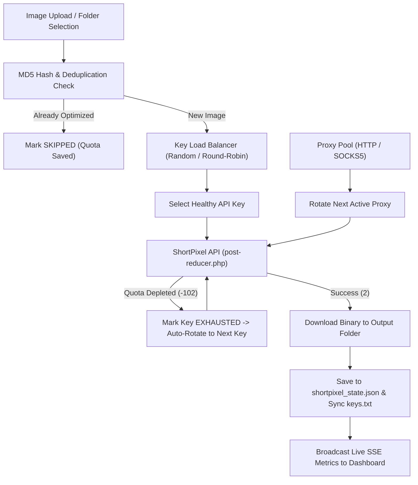

# ShortPixel Studio • Design System & Architecture (DESIGN.md)

## 1. Design System & UX Philosophy

ShortPixel Studio is engineered to feel like a high-performance **native desktop application** embedded in the browser, adhering to modern **Shadcn UI principles**:

### Visual & Color Tokens
- **Dark Mode Palette**: Pure Black (`#000000`) canvas with zinc surfaces:
  - Base Background: `#000000` (`bg-black`)
  - Elevated Cards & Panels: `#09090b` (`bg-zinc-950`) / `#121215` (`bg-zinc-900`)
  - Subtle Borders: `#27272a` (`border-zinc-800`) / `#18181b` (`border-zinc-850`)
  - Accents: Emerald (`#10b981`), Amber (`#f59e0b`), Cyan (`#06b6d4`), Indigo (`#6366f1`)
- **Light Mode Palette**: Crisp neutral zinc (`bg-zinc-50` with `bg-white` cards and `border-zinc-200`).
- **Typography**:
  - Primary Sans: `Inter` (neutral, crisp, geometric legibility)
  - Code & Metrics: `JetBrains Mono` (numbers, hashes, sizes, API masks)
- **Icons**: Clean vector iconography powered by **Lucide Icons**.

---

## 2. Component Architecture

```
Web Dashboard (SPA)
 ├── Desktop App Header
 │    ├── Branding & Version Badge
 │    ├── Live Aggregate Quota Pill
 │    ├── Light / Pure Black Dark Mode Toggle
 │    ├── Settings Dialog Trigger
 │    └── Instant Zip Archive Exporter
 ├── Metrics Overview Cards (Storage Saved, Quota Balance, Images, Infrastructure)
 ├── Multi-Tab Sidebar (4-Col)
 │    ├── API Key Pool Drawer (Live Quota, Sync to keys.txt, Add/Remove)
 │    ├── Proxy Pool Drawer (HTTP/SOCKS5, Latency Benchmarker, Toggle)
 │    └── Local Machine Folder Scanner
 └── Main Optimization Work Area (8-Col)
      ├── Controls Toolbar (Start, Pause, Resume, Stop, Concurrency)
      ├── Adaptive Dropzone & Folder Picker (`webkitdirectory`)
      ├── Real-Time Progress Bar & Worker Gauges
      ├── Rich Image Details Table (Thumbnails, Dimensions, MIME, Sizes, Keys, Proxies)
      ├── Live SSE Activity Console Stream
      └── Inspection & Before/After Comparison Modal
```

---

## 3. Core Engine & Data Flow



---

## 4. Key Mechanics

### 1. Zero-Downtime Multi-Key Load Balancing
- Distributes requests using a choice of 3 strategies:
  - **Random Load Balancing (`random`)** (Default): Distributes batches evenly across all keys with quota.
  - **Round-Robin (`round-robin`)**: Cycles sequentially on every image.
  - **Sequential (`sequential`)**: Uses key 1 until exhausted, then transitions to key 2.
- Automatically marks keys as `EXHAUSTED` when quota reaches 0 or API returns `-102`, failing over to healthy keys without aborting the batch.

### 2. Disk & Memory State Persistence
- Atomic dual-file write pattern (`.tmp` -> rename) ensures state integrity against crashes.
- Tracks file checksums, per-key lifetime usage, byte savings, and queue state.

### 3. Smart Output Routing
- **`source_folder` (Default)**: Saves optimized images next to their original source in `<Source_Folder>/optimized`, preserving nested directory structures.
- **`custom`**: User-defined output directory.
- **`app_root`**: Saves to project `./optimized` directory.

### 4. Proxy Pool Routing
- Supports standard `http://`, `https://`, and `socks5://` proxy endpoints.
- Auto-benchmarking measures round-trip latency to ShortPixel servers.
- Rotates proxies across image upload workers to eliminate IP throttling.
